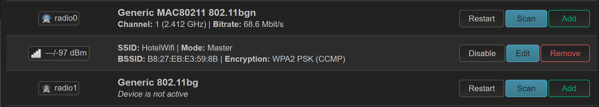
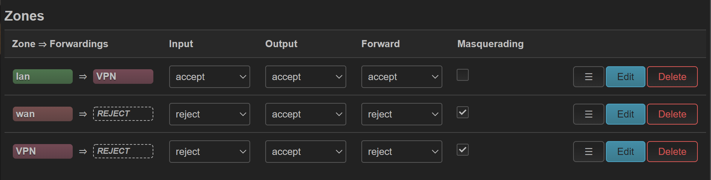
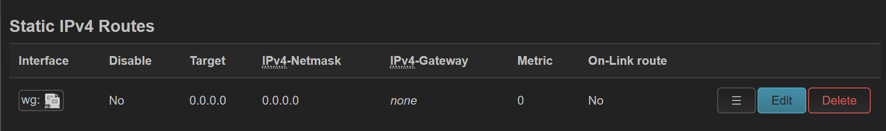

Hotel Wifi Condom
=================

Background
----------

I recently needed to go on holiday, and was staying in a hotel with WiFi. Out of an abundance of paranoia, I decided to try setup a "router" that could sit between my devices and the hotel network.

Goals
-----

The main goals were:

* Setup a NAT'd environment, so the hotel wifi cannot see my devices directly
* Connect to the hotel Wifi OR ethernet
* The auxiliary goals were:
* Tunnel all traffic through Wireguard or similar VPN.

Starting Point
--------------

Started with a Raspberry Pi 3.

Firmware: https://openwrt.org/toh/raspberry_pi_foundation/raspberry_pi#installation

After installation and gaining access (ethernet, static IP, etc), I created a WiFi network and gave it appropriate security.

From a google search, I was under the impression that the Pi could simultaneously transmit and connect to a wireless network,
but when I tried that, it was incredibly unreliable and dropped wireless constantly. I got back in and disabled that, and then added a USB wifi adapter.
Unfortunately, it wasn't detected out of the box, and I had to install the kernel drivers (opkg update && opkg install kmod-rt2800-usb).

Once that was done, I could connect the wifi and also run the wifi address simultaneously.

I then moved the ethernet to the WAN zone, and made it a DHCP client.

When I arrive at the hotel, I could use the the radio1 "Scan" button to add the hotel wireless. (In practice, this wasn't very useful, as the hotel wifi was garbage. It did work, it was just super slow. I used ethernet instead).

Wireguard
---------

I already have a wireguard server that I use as a VPN. I created another set of keys for my "Travel router", and then used the config on the router.

Install wireguard:

.. code-block:: none

    opkg update && opkg install luci-app-wireguard

Add a wireguard interface, using the config from the server to set it up. Add a VPN Zone and put the wireguard interface into it.
Firewall and Routing
Zones were setup like:

VPN was the Wireguard zone, WAN and LAN are the default zones. (I am not an expert, this may not be correct, but it does work).

Misc
----

* Disable SSH and WebUI from the WAN interfaces.
* Statistics??
* MSS Clamping: Under Network > Firewall, click -edit- beside the LAN -> VPN zone. The MSS Clamping toggle is in there
   * This is required to make it more reliable (Reddit app showed this problem initially)

* Wireguard failure to re-connect. Still have no idea what the cause of this is, and I have to restart the WG server side.
   * Caused by anti-replay on the wireguard server.
   * Fix is to restart wireguard after NTP sync: https://forum.openwrt.org/t/initiate-wireguard-after-ntp-success/14751/2

     .. code-block:: none

         mkdir -p /etc/hotplug.d/ntp
         cat <<EOT > /etc/hotplug.d/ntp/90-wireguard
         #!/bin/sh
         [ \$ACTION = stratum ] && /etc/init.d/wireguard restart
         EOT

Conclusion
----------

This seems to have worked so far, and I wrote this via the PiWifiCondom.

Whether it is as secure as I would like, I am not sure, but it definitely seems better than just raw dogging a random wifi network.
